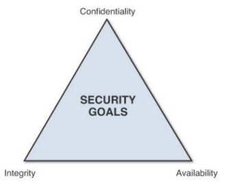

## Lecture 1

    
Security

    &nbsp;&nbsp;&nbsp;&nbsp;&nbsp; the state of being free from danger or threat

    
Information Security

    &nbsp;&nbsp;&nbsp;&nbsp;&nbsp; method of protecting digital information from unauthorized access.

    
What are the three Information  security principles?

    <ul>
        <li>Confidentiality</li>
        <li>Integrity</li>
        <li>Availability</li>
    </ul>

    
Confidentiality

    &nbsp;&nbsp;&nbsp;&nbsp;&nbsp; information is only being seen or used by people who are authorized to access it.

    
Integrity

    &nbsp;&nbsp;&nbsp;&nbsp;&nbsp; any change to the information by an unauthorized user is impossible and change by authorized user is tracked.

    
Availability

    &nbsp;&nbsp;&nbsp;&nbsp;&nbsp; the information is accessible when authorized users need it.

    
Threat

    &nbsp;&nbsp;&nbsp;&nbsp;&nbsp; possible danger that might exploit vulnerability

    
Attacks

    &nbsp;&nbsp;&nbsp;&nbsp;&nbsp; a deliberate attempt to violate the security policy of the system.

    
Security attack

    &nbsp;&nbsp;&nbsp;&nbsp;&nbsp; any action that compromises the security of information owned by the organization

    
Passive attack

    &nbsp;&nbsp;&nbsp;&nbsp;&nbsp; monitoring of transmission.

    
Types of attacks

    <ul>
        <li>Passive attack</li>
        <li>Active attack</li>
    </ul>

    
Passive attack

    &nbsp;&nbsp;&nbsp;&nbsp;&nbsp; monitoring of transmission

    
Active attack

    &nbsp;&nbsp;&nbsp;&nbsp;&nbsp; involves modification or false data stream creation.

    
Types of Passive attack

    <ul>
        <li> Release of message content </li>
        <li> Traffic Analysis </li>
    </ul>

    
Types of Active attack

    <ul>
        <li>Masquerade</li>
        <li>Modification of message</li>
        <li>Denail of Service (DOS) </li>
        <li>Replay</li>
    </ul>

    
Why it is difficult to detect?

    &nbsp;&nbsp;&nbsp;&nbsp;&nbsp; Because the sender and receiver can't detect third parties reading their messages.

    
Masquerade

    &nbsp;&nbsp;&nbsp;&nbsp;&nbsp; takes place when an entity pretends to be different entity.

    
Modification of message

    &nbsp;&nbsp;&nbsp;&nbsp;&nbsp; means that some portion of genuine message is altered or that message is delayed or reordered to produce an unautohrized effect.

    
Replay

    &nbsp;&nbsp;&nbsp;&nbsp;&nbsp; involves the passive capture of a data unit and its subsequent transimission to produce an unauthorized effect.

    
Denial of Service (DOS)

    &nbsp;&nbsp;&nbsp;&nbsp;&nbsp; prevents a normal use of management of communication facilities.

    
Authentication

    &nbsp;&nbsp;&nbsp;&nbsp;&nbsp; Is an assurance that the communication entity is the one that claims to be.

    
Types of authentication

    <ul>
        <li>Peer Entity authentication</li>
        <li>Data-Origin authentication</li>
    </ul>

    
Peer Entity authentication

    &nbsp;&nbsp;&nbsp;&nbsp;&nbsp; Peer entity authentication is the process of verifying the identity of entities involved in a logical connection to ensure their legitimacy.

    
Data-Origin authentication

    &nbsp;&nbsp;&nbsp;&nbsp;&nbsp; in a connectionless transfer, provides assurance that the source of received data is as claimed.

    
Data Confidentiality

    &nbsp;&nbsp;&nbsp;&nbsp;&nbsp; is the protection of data from unauthorized leak

    
Access Control

    &nbsp;&nbsp;&nbsp;&nbsp;&nbsp; is a prevention of unauthorized use of a resource.

    
Data Integrity

    &nbsp;&nbsp;&nbsp;&nbsp;&nbsp; is the assurance that the data received are exactly as sent by an authorized entity.

    
Nonrepudiation

    &nbsp;&nbsp;&nbsp;&nbsp;&nbsp; provides protection against denial of any one of the entities participating in a communication.

    
Types of nonrepudiation

    <ul>
        <li>Origin</li>
        <li>Destination</li>
    <ul>

    
Origin Nonrepudiation

    &nbsp;&nbsp;&nbsp;&nbsp;&nbsp; proof that the message was sent by the specified party.

    
Destination Nonrepudiation

    &nbsp;&nbsp;&nbsp;&nbsp;&nbsp; proof that the message was received by the specified party.

    
Security Mechanism

    &nbsp;&nbsp;&nbsp;&nbsp;&nbsp; a process that is designed to detect, prevent, or recover from security attack.

    
Encipherment

    &nbsp;&nbsp;&nbsp;&nbsp;&nbsp; use of mathematical algorithm to transform data into a form that is not readily intelligible.

    
Digital Signature

    &nbsp;&nbsp;&nbsp;&nbsp;&nbsp; Is a mechanism that proves the data source and integrity of the data unit and protects against unauthorized modification.

    
Access Control

    &nbsp;&nbsp;&nbsp;&nbsp;&nbsp; Provides access rights to resources (devices, files, storages)

    
Data Integrity

    &nbsp;&nbsp;&nbsp;&nbsp;&nbsp; a variety of mechanisms used to assure the integirty of a data unit or stream of data unit.

    
Traffic padding

    &nbsp;&nbsp;&nbsp;&nbsp;&nbsp; insertion of bits into gaps of data stream to frustrate traffic analysis attempts.

    
Routing control

    &nbsp;&nbsp;&nbsp;&nbsp;&nbsp; enables selection of particular physically secured routes for certain data and allows routing changes.

    
Notarization

    &nbsp;&nbsp;&nbsp;&nbsp;&nbsp; use of trusted third party to assure certain properties of data exchange.

 

#### Lecture 1 Test

    
What is traffic Analysis?

    &nbsp;&nbsp;&nbsp;&nbsp;&nbsp; Observing the pattern of messages

    
Why it is difficult to detect passive attack?

    &nbsp;&nbsp;&nbsp;&nbsp;&nbsp; Because the sender and receiver can't detect third parties reading their messages.

    
How do you prevent passive attack?

    &nbsp;&nbsp;&nbsp;&nbsp;&nbsp; By using encryption

    
Why it is difficult to prevent active attack?

    &nbsp;&nbsp;&nbsp;&nbsp;&nbsp; because of the wide variety of potential physical, software and network vulnerabilities.

    
What is the goal against passive attack?

    &nbsp;&nbsp;&nbsp;&nbsp;&nbsp; prevention rather than detection.

    
What is the goal against active attack?

    &nbsp;&nbsp;&nbsp;&nbsp;&nbsp; to detect them and recover from any disruption or delay.

    
What does "Access Control" control?

    &nbsp;&nbsp;&nbsp;&nbsp;&nbsp; who can access to a resource, what they allowed to do, and under what condition they can access it.

    
What does Data Integrity doesn't allow?

    &nbsp;&nbsp;&nbsp;&nbsp;&nbsp; it will not allow any modification, insertion or deletion to a resource.

    
What are information security principles?

    <ul>
        <li>Confidentiality</li>
        <li>Integirty</li>
        <li>Availability</li>
    </ul>
    _____________

    
Compare between attacks & threats

    <ul>
        <li>Threats is a possible danger that might exploit weakness example: Trojan</li>
        <li>Attack is a deliberate attempt to violate the security policy of the system   example: Hacking</li>
    </ul>

    
What does security attack mean? explain different type of attack

    &nbsp;&nbsp;&nbsp;&nbsp;&nbsp; attack is a deliberate attempt to violate the security policy of the system.
    <ul>
        <li>Passive Attack</li>
        <li>Active Attack</li>
    </ul>

    
What does security service mean? explain different types of security services

    &nbsp;&nbsp;&nbsp;&nbsp;&nbsp; it is a service that is provided by a system to give a specific kind of protection to a system resource.
    <ul>
        <li>Authentication</li>
        <li>Access Control</li>
        <li>Data Confidentiality</li>
        <li>Data Integrity</li>
        <li>Nonrepudiation</li>
    </ul>

    
What does security mechanism mean? explain different types of security machanisms

    &nbsp;&nbsp;&nbsp;&nbsp;&nbsp; It is a process that is designed to detect, prevent, or recover from security attack.
    <ul>
        <li>Encipherment</li>
        <li>Digital signature</li>
        <li>Access Control</li>
        <li>Data Integrity</li>
        <li>Authentication exchange</li>
        <li>Traffic padding</li>
        <li>Routing control</li>
        <li>Ntarization</li>
    </ul>

    
explain each of these terms

    <ul>
        <li>
            

                
traffic analysis

                &nbsp;&nbsp;&nbsp;&nbsp;&nbsp;Observing the pattern of messages
            

        </li>
        <li>
            

                
masquerade

                &nbsp;&nbsp;&nbsp;&nbsp;&nbsp;takes place when an entity pretends to be different entity.
            

        </li>
        <li>
            

                
DOS

                &nbsp;&nbsp;&nbsp;&nbsp;&nbsp;prevents a normal use of management of communication facilities.
            

        </li>
        <li>
            

                
data integrity

                &nbsp;&nbsp;&nbsp;&nbsp;&nbsp;is the assurance that the data received are exactly as sent by an authorized entity.
            

        </li>
        <li>
            

                
Access control

                &nbsp;&nbsp;&nbsp;&nbsp;&nbsp;is a prevention of unauthorized use of a resource.
            

        </li>
        <li>
            

                
traffic padding

                &nbsp;&nbsp;&nbsp;&nbsp;&nbsp;insertion of bits into gaps of data stream to frustrate traffic analysis attempts.
            

        </li>
        <li>
            

                
access control

                &nbsp;&nbsp;&nbsp;&nbsp;&nbsp;is a prevention of unauthorized use of a resource.
            

        </li>
        <li>
            

                
notarization

                &nbsp;&nbsp;&nbsp;&nbsp;&nbsp;use of trusted third party to assure certain properties of data exchange. 
            

        </li>
    </ul>

    
__________ Proof that the message was sent by the specificed party

    &nbsp;&nbsp;&nbsp;&nbsp;&nbsp; Origin Nonrepudiation

    
________ will not allow any modification, insertion, deletion to a data

    &nbsp;&nbsp;&nbsp;&nbsp;&nbsp;Data Integrity

    
_____ proves the data source and integrity of the data until and protect against unauthorized modification.

    &nbsp;&nbsp;&nbsp;&nbsp;&nbsp; Digital Signature

    
_______ means monitoring of transmission

    &nbsp;&nbsp;&nbsp;&nbsp;&nbsp;Passive attack

    
"What those that are accessing a resource allowed to do?" provided by which security serivce?

    &nbsp;&nbsp;&nbsp;&nbsp;&nbsp;Access control

    
______ any changes to the information by an unauthorized user is impossible.

    &nbsp;&nbsp;&nbsp;&nbsp;&nbsp; Integrity

    
______  provides protection against denial of any one of the entities participating in a communication.

    &nbsp;&nbsp;&nbsp;&nbsp;&nbsp; Nonrepudiation

    
_____________ uses trusted third party to assure certain properties of data exchange

    &nbsp;&nbsp;&nbsp;&nbsp;&nbsp;Notarization

    
_____ is a method of protecting digital information from unauthorized access.

    &nbsp;&nbsp;&nbsp;&nbsp;&nbsp; Information Security

    
________ observing the pattern of messages

    &nbsp;&nbsp;&nbsp;&nbsp;&nbsp; Traffic analysis

    
which type of attack is easy to detect?

    &nbsp;&nbsp;&nbsp;&nbsp;&nbsp;Active attack

    
________ is the assurance that the data received are exactly as sent by an authorized entity

    &nbsp;&nbsp;&nbsp;&nbsp;&nbsp;Data Integrity

    
What does DOS stand for?

    &nbsp;&nbsp;&nbsp;&nbsp;&nbsp;Denial of Service 

    
How many principlies does security follow? what are they?

    &nbsp;&nbsp;&nbsp;&nbsp;&nbsp; 3 principles
    <ul>
        <li>Confidentiality</li>
        <li>Integrity</li>
        <li>Availability</li>
    </ul>

    
"under what conditions access can occur" provided by which security serivce?

    &nbsp;&nbsp;&nbsp;&nbsp;&nbsp;Access control

    
The emphasis in dealing with _________ is on prevention rather than detection

    &nbsp;&nbsp;&nbsp;&nbsp;&nbsp;Passive attack

    
________ the information is accessible when authorized users need it.

    &nbsp;&nbsp;&nbsp;&nbsp;&nbsp; Availability

    
________ attack involves some modification of data stream or creation of false data stream.

    &nbsp;&nbsp;&nbsp;&nbsp;&nbsp; Active attack

    
_____________ enables selection of particular physically secured routes for certain data and allows routing changes especially when a breach of security is suspected

    &nbsp;&nbsp;&nbsp;&nbsp;&nbsp;Routing control

    
what type of attack involves the "Replay"?

    &nbsp;&nbsp;&nbsp;&nbsp;&nbsp;Active attack

    
What type of attack involves "Traffic analysis"?

    &nbsp;&nbsp;&nbsp;&nbsp;&nbsp;Passive attack

    
 hacking a specific webpage and behaving like a web page's admin is an example of __________ attack

    &nbsp;&nbsp;&nbsp;&nbsp;&nbsp; Masquerade

    
________ attack can be prevented by encryption

    &nbsp;&nbsp;&nbsp;&nbsp;&nbsp; Passive attack

    
_________ involves the passive capture of a data unit and its subsequent retransmission to produce an unauthorized effect.

    &nbsp;&nbsp;&nbsp;&nbsp;&nbsp;Replay

    
what type of attack involves the "release of message contents"?

    &nbsp;&nbsp;&nbsp;&nbsp;&nbsp;passive attack

    
__________ is a possible danger that might exploit vulnerability

    &nbsp;&nbsp;&nbsp;&nbsp;&nbsp; Threats

    
_____________ is a mechanism that proves the data source and integrity of the data unit and protect against unauthorized modification

    &nbsp;&nbsp;&nbsp;&nbsp;&nbsp;Digital Signature

    
__________ in a connectionless transfer provides assurance that the source of received data is as claimed.

    &nbsp;&nbsp;&nbsp;&nbsp;&nbsp; Data-Origin Authentication

    
_____________ a variety of mechanisms used to assure the integrity of a data unit or stream of data unit

    &nbsp;&nbsp;&nbsp;&nbsp;&nbsp;Data Integrity

    
_____________ insertion of bits into gaps of data stream to frustrate traffic analysis attempts.

    &nbsp;&nbsp;&nbsp;&nbsp;&nbsp;Traffic padding

    
what type of attack involves the "Denial of Service"?

    &nbsp;&nbsp;&nbsp;&nbsp;&nbsp;Active attack

    
_____ information is only being seen or used by people who are authorized to access it.

    &nbsp;&nbsp;&nbsp;&nbsp;&nbsp; Confidentiality

    
_____ is an assurance that the communicating entity is the one that claims to be

    &nbsp;&nbsp;&nbsp;&nbsp;&nbsp; Authentication

    
__________ Proof that the message was received by the specificed party

    &nbsp;&nbsp;&nbsp;&nbsp;&nbsp; Destination Nonrepudiation

    
_____ is the protection of data from unauthorized leak

    &nbsp;&nbsp;&nbsp;&nbsp;&nbsp; Data confidentiality

    
_________ is a prevention of unauthorized use of resource

    &nbsp;&nbsp;&nbsp;&nbsp;&nbsp; Access Control

    
_________ prevents a normal use of management communication facilities.

    &nbsp;&nbsp;&nbsp;&nbsp;&nbsp;Denial of Service

    
_____________ identifies an entity by means of information exchange

    &nbsp;&nbsp;&nbsp;&nbsp;&nbsp;authentication exchange

    
___________ use of mathematical algorithm to transform data into a form that is not readily intelligible

    &nbsp;&nbsp;&nbsp;&nbsp;&nbsp;Encipherment

    
_________ some portion of genuine message is altered or that message are delayed or reordered to produce an unauthorized effect

    &nbsp;&nbsp;&nbsp;&nbsp;&nbsp;Modification of message

    
_____ is any action that compromises the security of information owned by the organization

    &nbsp;&nbsp;&nbsp;&nbsp;&nbsp; Security attack

    
______  provided by a system to give a specific kind of protection to a system resource.

    &nbsp;&nbsp;&nbsp;&nbsp;&nbsp; Security services.

    
which type of attack is difficult to prevent?

    &nbsp;&nbsp;&nbsp;&nbsp;&nbsp;Active attack

    
_____________ provides access rights to resources

    &nbsp;&nbsp;&nbsp;&nbsp;&nbsp;Access control

    
"who can have access to a resource" provided by which security serivce?

    &nbsp;&nbsp;&nbsp;&nbsp;&nbsp;Access control

    
________ used in association with a logical connection to provide confidence in the identity of the entities connected.

    &nbsp;&nbsp;&nbsp;&nbsp;&nbsp; Peer Entity Authentication

    
what type of attack involves the "Modification of Message"?

    &nbsp;&nbsp;&nbsp;&nbsp;&nbsp;Active attack

    
which type of attack is easy to prevent?

    &nbsp;&nbsp;&nbsp;&nbsp;&nbsp;passive attack

    
_________ takes place when an entity pretends to be different entity

    &nbsp;&nbsp;&nbsp;&nbsp;&nbsp;Masquerade

    
____ the state of being free from danger or threat

    &nbsp;&nbsp;&nbsp;&nbsp;&nbsp; Security

    
___________ is a delibrate attempt to violate the security of the system

    &nbsp;&nbsp;&nbsp;&nbsp;&nbsp; Attacks

    
which type of attack is hard to detect?

    &nbsp;&nbsp;&nbsp;&nbsp;&nbsp;Passive attack

    
 _______ means the right inof should be available to the right users at the right time

    &nbsp;&nbsp;&nbsp;&nbsp;&nbsp; Availability

    
 getting a specific account and behaving like the account's owner is an example of __________ attack

    &nbsp;&nbsp;&nbsp;&nbsp;&nbsp; Masquerade

    
__________ process that is designed to detect, prevent, or recover from security attack.

    &nbsp;&nbsp;&nbsp;&nbsp;&nbsp; Security mechanism

    
In _________ attack the goal is to detect them and to recover from any disruption or delays caused by them

    &nbsp;&nbsp;&nbsp;&nbsp;&nbsp;Active attack

    
what type of attack involves the "Masquerade"?

    &nbsp;&nbsp;&nbsp;&nbsp;&nbsp;Active attack

    
______ any changes to the information by an authorized user is tracked.

    &nbsp;&nbsp;&nbsp;&nbsp;&nbsp; Integrity

 

## Lecture 2

    
Cryptography

    &nbsp;&nbsp;&nbsp;&nbsp;&nbsp; is the science of using mathematics to encrypt and decrypt data.

    
Cryptanalysis

    &nbsp;&nbsp;&nbsp;&nbsp;&nbsp; technique used for deciphering a message without any knowledge of enciphering text.

    
Cryptology

    &nbsp;&nbsp;&nbsp;&nbsp;&nbsp; is the area of cryptography and cryptanalysis used together

    
Plain text

    &nbsp;&nbsp;&nbsp;&nbsp;&nbsp; the original text fed to encryption algorithm.

    
Cipher text

    &nbsp;&nbsp;&nbsp;&nbsp;&nbsp; the coded random stream of data text depending on plain text and secret key.

    
Enciphering

    &nbsp;&nbsp;&nbsp;&nbsp;&nbsp; the process of converting plain text to cipher text.

    
Encryption

    &nbsp;&nbsp;&nbsp;&nbsp;&nbsp; the process of converting plain text to cipher text.

    
Deciphering

    &nbsp;&nbsp;&nbsp;&nbsp;&nbsp; The process of converting cipher text to plain text.

    
Decryption

    &nbsp;&nbsp;&nbsp;&nbsp;&nbsp; The process of converting cipher text to plain text.

    
Substitution ciphers

    &nbsp;&nbsp;&nbsp;&nbsp;&nbsp; acts on the plain text by making a substitution of the characters with the leemtns of a new alphabet.

    
Monoalphabetic Ciphers

    &nbsp;&nbsp;&nbsp;&nbsp;&nbsp; a monoalphabetic cipher uses the same substitution across the entire message.

    
Caesar Cipher

    &nbsp;&nbsp;&nbsp;&nbsp;&nbsp; the simplest substitution cipher intrdouced by Julius Ceasar.

    
Polyalphabetic ciphers

    &nbsp;&nbsp;&nbsp;&nbsp;&nbsp; the substitution may change throughout the message.

    
Polygraphic ciphers

    &nbsp;&nbsp;&nbsp;&nbsp;&nbsp; instead of substituting one letter for another letter it performs substitutions with two or more groups of letters.

    
Playfair cipher

    &nbsp;&nbsp;&nbsp;&nbsp;&nbsp; is a best known as multiple-letter cipher based on the use of 5x5 matrix of letters using a keyword.

    
Transport cipher

    &nbsp;&nbsp;&nbsp;&nbsp;&nbsp; a block cipher which acts on the plaintext by permuting the positions of the characters in the plaintext

    
Rail Fence cipher

    &nbsp;&nbsp;&nbsp;&nbsp;&nbsp; the plaintext is written downwards and diagonally on successive "rails" of an imaginary fence.

    
The two ways that ciphers may be secure

    <ol>
        <li>computational security</li>
        <li>unconditional security</li>
    </ol>

    
computational security

    &nbsp;&nbsp;&nbsp;&nbsp;&nbsp; given limited computing resources, the cipher cannot be broken.

    
unconditional security

    &nbsp;&nbsp;&nbsp;&nbsp;&nbsp; no matter how much computer power is available, the cipher cannot be broken.

    
Ciphertext-only attack

    &nbsp;&nbsp;&nbsp;&nbsp;&nbsp; the situation where the attacker doesn ot know anything about the contents of the message.

    
Known-plaintext attack

    &nbsp;&nbsp;&nbsp;&nbsp;&nbsp; the attacker knows or can guess the plaintext for some parts of the Ciphertext. the task is to decrypt the rest of the ciphertext blocks using this information.

    
Chosen-plaintext attack

    &nbsp;&nbsp;&nbsp;&nbsp;&nbsp; the attacker is able to have any text he likes encrypted with the unknown key. The task is to determine the key used for encryption.

    
Man-in-middle attack

    &nbsp;&nbsp;&nbsp;&nbsp;&nbsp; two parties are exchanging keys for secure communication, an adversary puts himself between the prties on the communication line.

    
Frequency analysis

    &nbsp;&nbsp;&nbsp;&nbsp;&nbsp; the study of the frequency of letters or groups of letters in a ciphertext.

    
counting letters

    &nbsp;&nbsp;&nbsp;&nbsp;&nbsp; the study of the frequency of letters or groups of letters in a ciphertext.

    
Block Cipher

    &nbsp;&nbsp;&nbsp;&nbsp;&nbsp; is an encryption/decryption scheme in which a block of plaintext is used to produce a cipher text block of equal length.

    
examples of block cipher algorithm

    <ul>
        <li>DES</li>
        <li>3DES</li>
        <li>AES</li>
    </ul>

#### Lecture 2 test

    
__________ in any given language, certain letters and combinations of letters occur with varying frequencies.

    &nbsp;&nbsp;&nbsp;&nbsp;&nbsp; frequency letters (counting letters)

 
 
 

## Abbrevations

    
DOS

    &nbsp;&nbsp;&nbsp;&nbsp;&nbsp; Denial of Service

    
DES

    &nbsp;&nbsp;&nbsp;&nbsp;&nbsp; Data Encryption Standard

    
3DES

    &nbsp;&nbsp;&nbsp;&nbsp;&nbsp; Triple Data Encryption Standard

    
AES

    &nbsp;&nbsp;&nbsp;&nbsp;&nbsp; Advance Encryption Standard

